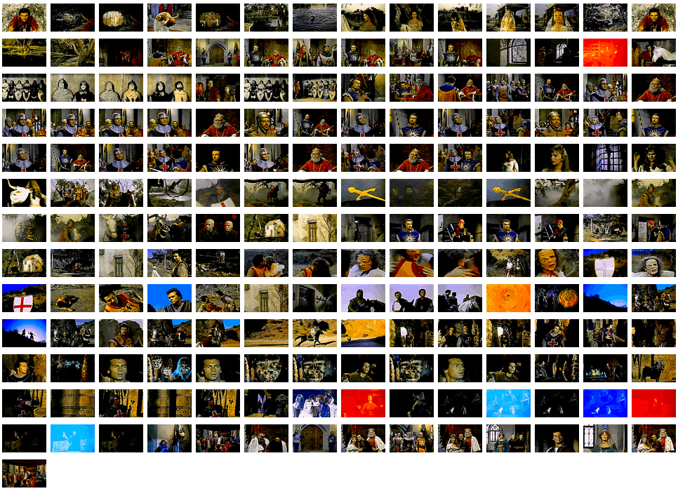

   # movie-thumbnailer

[](https://github.com/Indiscipline/movie-thumbnailer/blob/master/LICENSE.md)

Command line "glue" for [ffmpeg](https://ffmpeg.org/) and [ImageMagick](https://www.imagemagick.org/) which generates wallpaper  from video files, containing frames with scene changes
The program expects `ffmpeg` and `magick` to be in your PATH.

**Expanded description [>> in the blog post <<](https://indiscipline.github.io/post/movie-thumbnailer-announcement/)**

Developed using the wonderful [Clap](https://github.com/kbknapp/clap-rs) and [Rayon](https://github.com/rayon-rs/rayon) crates.

## Usage



Provide movie-thumbnailer with the path to the video file of your choice and the list of wallpaper resolutions you'd like it to generate collages for. The program puts temporary files in the current directory. It creates a folder `frames` where it puts the result of ffmpeg scene extraction and then pauses. This is the most time consuming part of the process. At this point the user should manually scan the extracted frames and remove unwanted/duplicate/false-identified frames. Upon resuming, movie-thumbnailer uses imagemagick for preprocessing the remaining frames (mostly for better sharpness and contrast in reduced size) and puts them in the `frames_scaled` directory. Then optimal size for the thumbnails and the final layout are calculated for each of the resolutions and the collages are created. Resulting files saved as `png` with transparent background.

The program tries to be "smart" and calculates the layout so there's some spacing between frames and the composite doesn't cover all the available space, leaving some margins (6% of the screen width and 18% of the height). At the moment, coefficients are hard-coded in `calc_thumbnail_size` function.

Usage example:
```
movie-thumbnailer -r 2560x1440,1920x1080,1366x768 TheMagickSword.mp4
```


Full help available on `--help` switch.

Example wallpaper is generated from the 1962 Bert I. Gordon movie ["The Magick Sword"](https://en.wikipedia.org/wiki/The_Magic_Sword_(1962_film)) which is in public domain and [available from Archive.org](https://archive.org/details/TheMagicSword).

## How to build
Developed with stable Rust.

To build the code, go to the project directory and run:

```
$ cargo build --release
```

The executable will be `target/release/movie-thumbnailer`.


## Contributing ##
This is a small helper utility which achieves its intended functionality, but if you know how to improve it, file a bug report via [Issues](https://github.com/Indiscipline/movie-thumbnailer/issues).

Possible enhancements:
* [ ] Options for margin coefficients
* [ ] Option for scene detection threshold
* [ ] Ask for removing temporary files on completion
* [ ] Open the file browser with the `frames` directory at the manual thinnig-out stage
* [ ] Option for generating the final image with any solid background

## License ##
**movie-thumbnailer** licensed under GNU General Public License version 3 or later;

See `LICENSE.md` for full details.
